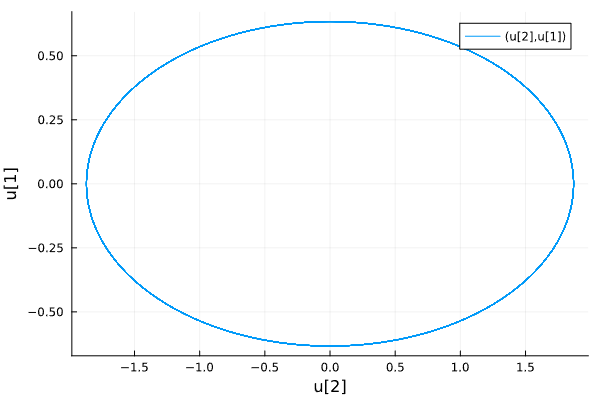
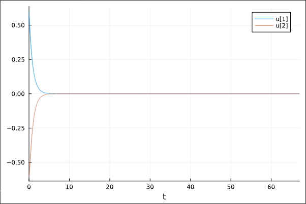
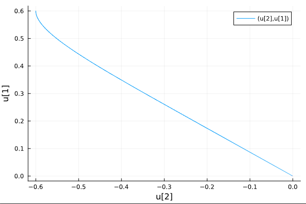
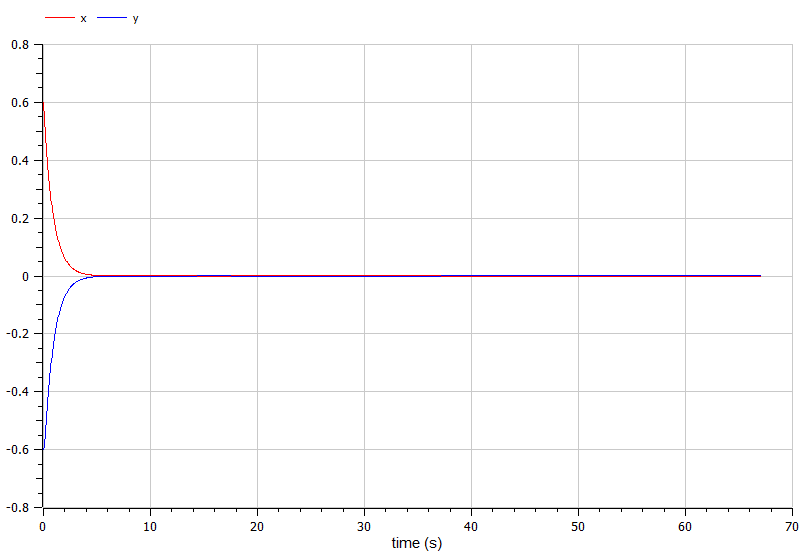
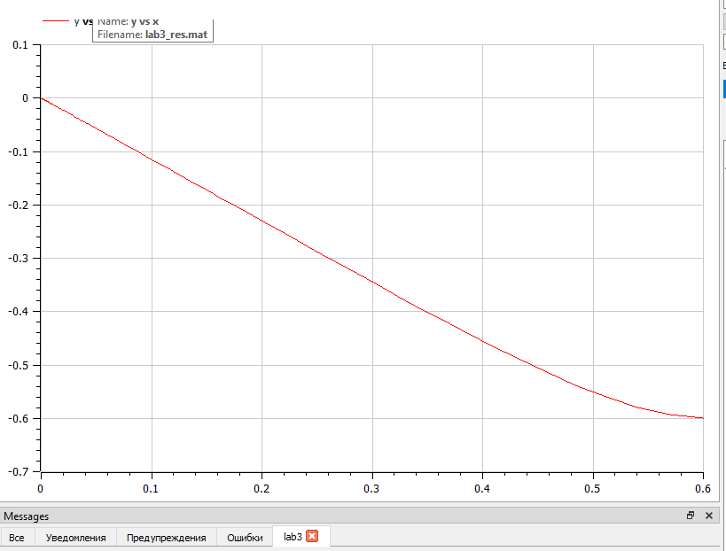

---
## Front matter
title: "Отчёт по лабораторной работе №4"
subtitle: "Модель гармонических колебаний"
author: "Артамонов Тимофей Евгеньевич"

## Generic otions
lang: ru-RU
toc-title: "Содержание"

## Bibliography
bibliography: bib/cite.bib
csl: pandoc/csl/gost-r-7-0-5-2008-numeric.csl

## Pdf output format
toc: true # Table of contents
toc-depth: 2
lof: true # List of figures
lot: true # List of tables
fontsize: 12pt
linestretch: 1.5
papersize: a4
documentclass: scrreprt
## I18n polyglossia
polyglossia-lang:
  name: russian
  options:
	- spelling=modern
	- babelshorthands=true
polyglossia-otherlangs:
  name: english
## I18n babel
babel-lang: russian
babel-otherlangs: english
## Fonts
mainfont: PT Serif
romanfont: PT Serif
sansfont: PT Sans
monofont: PT Mono
mainfontoptions: Ligatures=TeX
romanfontoptions: Ligatures=TeX
sansfontoptions: Ligatures=TeX,Scale=MatchLowercase
monofontoptions: Scale=MatchLowercase,Scale=0.9
## Biblatex
biblatex: true
biblio-style: "gost-numeric"
biblatexoptions:
  - parentracker=true
  - backend=biber
  - hyperref=auto
  - language=auto
  - autolang=other*
  - citestyle=gost-numeric
## Pandoc-crossref LaTeX customization
figureTitle: "Рис."
tableTitle: "Таблица"
listingTitle: "Листинг"
lofTitle: "Список иллюстраций"
lotTitle: "Список таблиц"
lolTitle: "Листинги"
## Misc options
indent: true
header-includes:
  - \usepackage{indentfirst}
  - \usepackage{float} # keep figures where there are in the text
  - \floatplacement{figure}{H} # keep figures where there are in the text
---

# Цель работы

* Построить решение уравнения гармонического осциллятора для разных случаев:
- без затухания и внешней силы,
- с затуханием без внешней силы
- с затуханием и внешней силой
* Построить фазовые портреты для каждого случая
  
# Теоретическое введение

Гармони́ческие колеба́ния — колебания, при которых физическая величина изменяется 
с течением времени по гармоническому (синусоидальному, косинусоидальному) закону. 

Свободные колебания совершаются под действием внутренних сил системы после того, как система 
была выведена из положения равновесия. Чтобы свободные колебания были гармоническими, необходимо, 
чтобы колебательная система была линейной (описывалась линейными уравнениями движения), и в ней 
отсутствовала диссипация энергии (при ненулевой диссипации, в системе после возбуждения происходят 
затухающие колебания).

Вынужденные колебания совершаются под воздействием внешней периодической силы. Чтобы вынужденные 
колебания были гармоническими, достаточно, чтобы колебательная система была линейной 
(описывалась линейными уравнениями движения), а внешняя сила (воздействие) менялась со временем 
как гармоническое колебание (то есть, чтобы зависимость от времени этой силы тоже, в свою очередь, 
была синусоидальной). [@wiki-bash]

Уравнение свободных колебаний гармонического осциллятора имеет следующий вид:
$$
\ddot{x} + 2\gamma \dot{x} + \omega^2 x = 0,
$$

где x – переменная, описывающая состояние системы (смещение грузика, заряд конденсатора и т.д.), 
$\gamma$ – параметр, характеризующий потери энергии (трение в механической системе, сопротивление в контуре),
$\omega^2$ – собственная частота колебаний, t – время.

При отсутствии потерь в системе ($\gamma = 0$) вместо первого уравнения получаем уравнение консервативного 
осциллятора энергия колебания которого сохраняется во времени:
$$
\ddot{x} + \omega^2 x = 0
$$

Для однозначной разрешимости уравнения второго порядка (2) необходимо задать два начальных условия вида:
$$
\begin{cases}
    x(t_0) = x_0, \\ 
    \dot{x(t_0)} = y_0.
\end{cases}
$$

Также может появится внешняя сила, действующая на осциллятор, в этом случае уравнение примет вид:

$$
\ddot{x} + 2\gamma \dot{x} + \omega^2 x = \F(t),
$$
где $F(t)$ - внешняя сила.

Независимые переменные x, y определяют пространство, в котором «движется» решение. 
Это фазовое пространство системы, поскольку оно двумерно будем называть его фазовой плоскостью.
Значение фазовых координат x, y в любой момент времени полностью определяет состояние системы. 
Решению уравнения движения как функции времени отвечает гладкая кривая в фазовой плоскости. 
Она называется фазовой траекторией. Если множество различных решений (соответствующих различным
начальным условиям) изобразить на одной фазовой плоскости, возникает общая картина поведения системы. 
Такую картину, образованную набором фазовых траекторий, называют фазовым портретом.

# Постановка задачи

1. Построить решение уравнения гармонического осциллятора без затухания. Построить фазовый портрет.
2. Записать уравнение свободных колебаний гармонического осциллятора с затуханием, построить его решение.
Построить фазовый портрет гармонических колебаний с затуханием.
3. Записать уравнение колебаний гармонического осциллятора, если на систему действует внешняя сила, 
построить его решение. Построить фазовый портрет колебаний с действием внешней силы.

# Задание 

Постройте фазовый портрет гармонического осциллятора и решение уравнения гармонического осциллятора для следующих случаев:

1. Колебания гармонического осциллятора без затуханий и без действий внешней силы
$$
\ddot{x} + 8.7x = 0
$$
2. Колебания гармонического осциллятора c затуханием и без действий внешней силы
$$
\ddot{x} + 8.7\dot{x} + 8.7x = 0
$$
3. Колебания гармонического осциллятора c затуханием и под действием внешней силы
$$
\ddot{x} + 8.7 \dot{x} + 8.7 x = 8.7 \sin(2t)
$$
На интервале t = (0; 67) (шаг 0.05) с начальными условиями $x_0 = 0.6, y_0 = -0.6$

# Выполнение лабораторной работы

Написали код на Julia:

using DifferentialEquations, Plots, OrdinaryDiffEq

#Функия колебаний без внешних сил
function osci_wo_force(dx, x, p, t)
    gamma, w = p
    dx[1] = x[2]
    dx[2] = -w .* x[1] - gamma .* x[2]
end

#Функия колебаний с внешними силами
function osci_w_force(dx, x, p, t)
    gamma, w = p
    dx[1] = x[2]
    dx[2] = -w .* x[1] - gamma .* x[2] .+ f(t)
end

#Начальные условия
a = 8.7
a1 = [0, a]
a2 = [a, a]
x0 = [0.6, -0.6]
tspan = (0, 67)

f(t) = a*sin(2*t)

#Случай 1
prob1 = ODEProblem(osci_wo_force, x0, tspan, a1)
sol1 = solve(prob1, dtmax = 0.05)

#plot(sol1) # График колебаний
#plot(sol1, vars = (2, 1)) #Фазовый портрет

#Случай 2
prob2 = ODEProblem(osci_wo_force, x0, tspan, a2)
sol2 = solve(prob2, dtmax = 0.05)

#plot(sol2) # График колебаний
#plot(sol2, vars = (2, 1)) #Фазовый портрет

#Случай 3
prob3 = ODEProblem(osci_w_force, x0, tspan, a2)
sol3 = solve(prob3, dtmax = 0.05)
#plot(sol3) # График колебаний
plot(sol3, vars = (2, 1)) #Фазовый портрет

Записали 3 случая на языке OpenModelica 

model lab4

Real x(start = 0.6);
Real y(start = -0.6);

parameter Real omega = 8.7;
parameter Real gamma = 0;

equation
  der(x) = y;
  der(y) = -omega*x - gamma*y;

end lab4;

model lab4

Real x(start = 0.6);
Real y(start = -0.6);

parameter Real omega = 8.7;
parameter Real gamma = 8.7;

equation
  der(x) = y;
  der(y) = -omega*x - gamma*y;

end lab4;

model lab4

Real x(start = 0.6);
Real y(start = -0.6);

parameter Real omega = 8.7;
parameter Real gamma = 8.7;

Real p;

equation
  der(x) = y;
  der(y) = -omega*x - gamma*y + p;
  p = 8.7*sin(2*time);
  
end lab4;

и получили следующие результаты.

##Построили график решения осциллятора без затуханий и внешней силы на Julia. (рис. [-@fig:001])

{ #fig:001 width=70% }

##Построили фазовый портерт на Julia. (рис. [-@fig:002])

{ #fig:002 width=70% }

##Построили график решения осциллятора на OpenModelica. (рис. [-@fig:003])

{ #fig:003 width=70% }

##Построили фазовый портерт на OpenModelica. (рис. [-@fig:004])

{ #fig:004 width=70% }

##Построили график решения осциллятора с затуханием без внешней силы на Julia. (рис. [-@fig:005])

{ #fig:005 width=70% }

##Построили фазовый портерт на Julia. (рис. [-@fig:006])

{ #fig:006 width=70% }

##Построили график решения осциллятора на OpenModelica. (рис. [-@fig:007])

{ #fig:007 width=70% }

##Построили фазовый портерт на OpenModelica. (рис. [-@fig:008])

{ #fig:008 width=70% }

##Построили график решения осциллятора с затуханием и внешней силой на Julia. (рис. [-@fig:009])

{ #fig:009 width=70% }

##Построили фазовый портерт на Julia. (рис. [-@fig:010])

{ #fig:010 width=70% }

##Построили график решения осциллятора на OpenModelica. (рис. [-@fig:007])

{ #fig:007 width=70% }

##Построили фазовый портерт на OpenModelica. (рис. [-@fig:008])

{ #fig:008 width=70% }

# Выводы

Построили графики решения гармонического осциллятора а так же их фазовые портреты для 3 разных случаев:
- без затухания и действия внешних сил
- с затуханием и без действия внешних сил
- с затуханием и действием внешних сил

# Список литературы{.unnumbered}

::: {#refs}
:::
