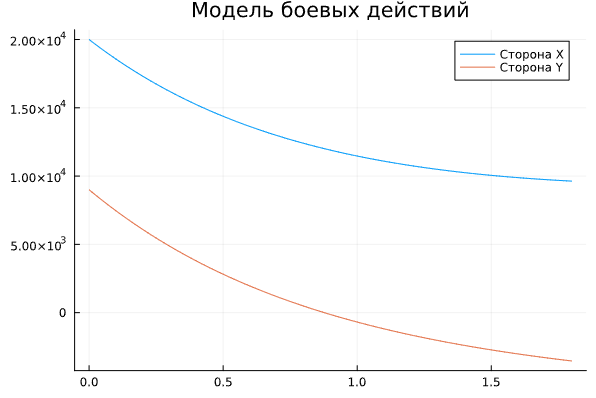
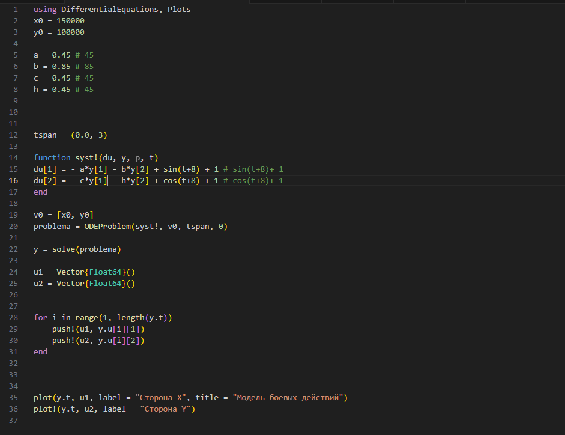
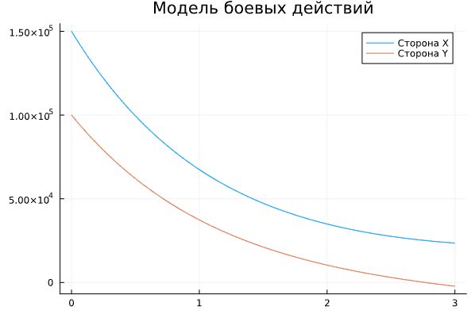
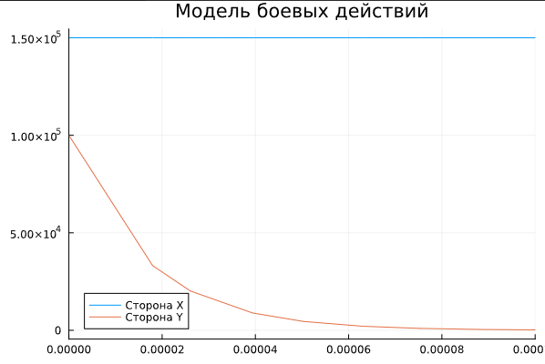
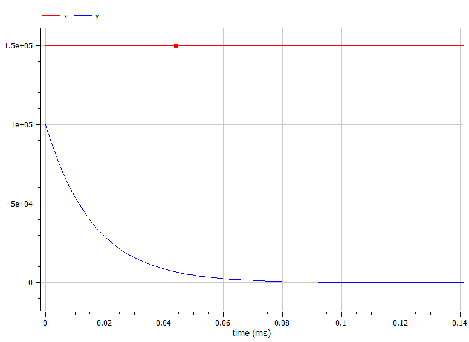

---
## Front matter
title: "Отчёт по лабораторной работе №4"
subtitle: "Модель гармонических колебаний"
author: "Артамонов Тимофей Евгеньевич"

## Generic otions
lang: ru-RU
toc-title: "Содержание"

## Bibliography
bibliography: bib/cite.bib
csl: pandoc/csl/gost-r-7-0-5-2008-numeric.csl

## Pdf output format
toc: true # Table of contents
toc-depth: 2
lof: true # List of figures
lot: true # List of tables
fontsize: 12pt
linestretch: 1.5
papersize: a4
documentclass: scrreprt
## I18n polyglossia
polyglossia-lang:
  name: russian
  options:
	- spelling=modern
	- babelshorthands=true
polyglossia-otherlangs:
  name: english
## I18n babel
babel-lang: russian
babel-otherlangs: english
## Fonts
mainfont: PT Serif
romanfont: PT Serif
sansfont: PT Sans
monofont: PT Mono
mainfontoptions: Ligatures=TeX
romanfontoptions: Ligatures=TeX
sansfontoptions: Ligatures=TeX,Scale=MatchLowercase
monofontoptions: Scale=MatchLowercase,Scale=0.9
## Biblatex
biblatex: true
biblio-style: "gost-numeric"
biblatexoptions:
  - parentracker=true
  - backend=biber
  - hyperref=auto
  - language=auto
  - autolang=other*
  - citestyle=gost-numeric
## Pandoc-crossref LaTeX customization
figureTitle: "Рис."
tableTitle: "Таблица"
listingTitle: "Листинг"
lofTitle: "Список иллюстраций"
lotTitle: "Список таблиц"
lolTitle: "Листинги"
## Misc options
indent: true
header-includes:
  - \usepackage{indentfirst}
  - \usepackage{float} # keep figures where there are in the text
  - \floatplacement{figure}{H} # keep figures where there are in the text
---

# Цель работы

* Построить решение уравнения гармонического осциллятора для разных случаев:
- без затухания и внешней силы,
- с затуханием без внешней силы
- с затуханием и внешней силой
* Построить фазовые портреты для каждого случая
  
# Теоретическое введение

Гармони́ческие колеба́ния — колебания, при которых физическая величина изменяется 
с течением времени по гармоническому (синусоидальному, косинусоидальному) закону. 

Свободные колебания совершаются под действием внутренних сил системы после того, как система 
была выведена из положения равновесия. Чтобы свободные колебания были гармоническими, необходимо, 
чтобы колебательная система была линейной (описывалась линейными уравнениями движения), и в ней 
отсутствовала диссипация энергии (при ненулевой диссипации, в системе после возбуждения происходят 
затухающие колебания).

Вынужденные колебания совершаются под воздействием внешней периодической силы. Чтобы вынужденные 
колебания были гармоническими, достаточно, чтобы колебательная система была линейной 
(описывалась линейными уравнениями движения), а внешняя сила (воздействие) менялась со временем 
как гармоническое колебание (то есть, чтобы зависимость от времени этой силы тоже, в свою очередь, 
была синусоидальной). [@wiki-bash]

Уравнение свободных колебаний гармонического осциллятора имеет следующий вид:
\ddot{x} + 2\gamma \dot{x} + \omega^2 x

# Постановка задачи

Между страной Х и страной У идет война. Численность состава войск исчисляется от начала войны, 
и являются временными функциями x(t) и y(t). В начальный момент времени страна Х имеет армию 
численностью 150 000 человек, а в распоряжении страны У армия численностью в 100 000 человек. 
Для упрощения модели считаем, что коэффициенты, 

Вариант 1					

| Коэффициенты при x(t) | Коэффициенты при y(t) |
|-----------------------|-----------------------|
| a = 0.45    		| b = 0.85   		|
| c = 0.45    		| h = 0.45   		|

и функции
P(t) = sin(t+8) + 1 
Q(t) = cos(t+8) + 1

Вариант 2					

| Коэффициенты при x(t) | Коэффициенты при y(t) |
|-----------------------|-----------------------|
| a = 0.31    		| b = 0.79   		|
| c = 0.41    		| h = 0.32   		|

P(t) = 2sin(t)
Q(t) = 2cos(t) - постоянны и непрерывны соответственно.

# Задание 

1. Постройте графики изменения численности войск армии Х и армии У для Модели боевых действий 
между регулярными войсками
2. Постройте графики изменения численности войск армии Х и армии У для Модели ведения боевых 
действий с участием регулярных войск и
партизанских отрядов
3. Построить графики на языках Julia и OpenModelica
4. Сравнить результаты

# Выполнение лабораторной работы

##Переписали код из примера лабораторной работы на язык Julia и посмотрели на результат работы программы. (рис. [-@fig:001])

{ #fig:001 width=70% }

##Сделали то же самое для языка OpenModelica. (рис. [-@fig:002])

{ #fig:002 width=70% }

##Подставили свои данные для случая с регулярными войсками для Julia. (рис. [-@fig:003])

{ #fig:003 width=70% }

##Нарисовали график для первого случая. (рис. [-@fig:004])

{ #fig:004 width=70% }

##Подставили свои значения для первого случая в OMEditб, в настройках модели задали промежуток и построили график. (рис. [-@fig:005])

{ #fig:005 width=70% }

##Подставили значения для второго случая и изменили функцию в Julia. (рис. [-@fig:006])

{ #fig:006 width=70% }

##Построили график и приблизили так, чтобы хорошо было видно изменение функции, понадобилось приблизить до интервала (0, 0.0001). (рис. [-@fig:007])
Видно что функция немного негладкая.

{ #fig:007 width=70% }

##Сделаем то же самое в OpenModelica. (рис. [-@fig:008])

{ #fig:008 width=70% }

##Посмотрим на график, пришлось сделать разбиение на 500 отрезков интервала (0, 0.001). (рис. [-@fig:009])

{ #fig:009 width=70% }

# Выводы

Построили модели боевых действия для 2 случаев на 2 языках. Выяснили, что на OpenModelica графики точнее. Познакомились и научились строить модели боевых действий.

# Список литературы{.unnumbered}

::: {#refs}
:::
