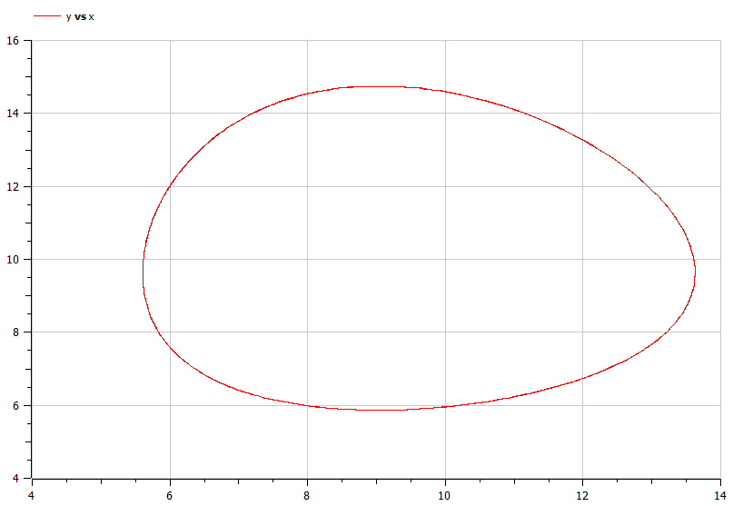
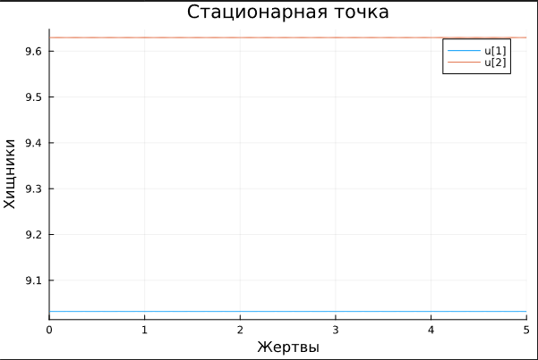
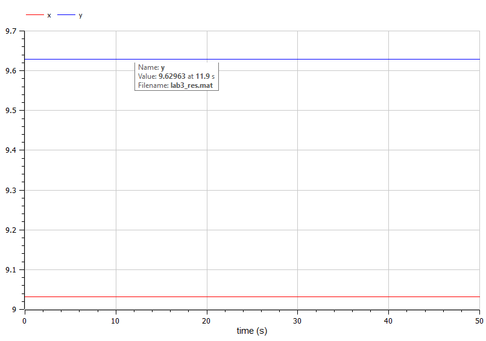

---
## Front matter
lang: ru-RU
title: Доклад
subtitle: Модели с урнами
author:
  - Артамонов Т. Е.
institute:
  - Российский университет дружбы народов, Москва, Россия
date: 8 августа 2024

## i18n babel
babel-lang: russian
babel-otherlangs: english

## Formatting pdf
toc: false
toc-title: Содержание
slide_level: 2
aspectratio: 169
section-titles: true
theme: metropolis
header-includes:
 - \metroset{progressbar=frametitle,sectionpage=progressbar,numbering=fraction}
 - '\makeatletter'
 - '\beamer@ignorenonframefalse'
 - '\makeatother'
---

# Информация

## Докладчик

:::::::::::::: {.columns align=center}
::: {.column width="70%"}

  * Артамонов Тимофей Евгеньевич
  * студент группы НКНбд-01-21
  * Российский университет дружбы народов
  * <https://github.com/teartamonov>

:::
::: {.column width="30%"}

:::
::::::::::::::

# Введение

## Цель работы

- Построить график зависимости численности хищников от численности жертв, а также графики изменения численности хищников и численности жертв при
следующих начальных условиях: $x_0 = 6$, $y_0 = 12$.
- Найти стационарное состояние системы.

## Теоретическое введение

Модель Лотки — Вольтерры — модель взаимодействия двух видов типа «хищник — жертва», названная в честь своих авторов (Лотка, 1925; Вольтерра 1926), 
которые предложили модельные уравнения независимо друг от друга.
Такие уравнения можно использовать для моделирования систем «хищник — жертва», «паразит — хозяин», 
конкуренции и других видов взаимодействия между двумя видами.

## Теоретическое введение. Предположения $1/2$

Простейшая модель взаимодействия двух видов типа «хищник — жертва» - модель Лотки-Вольтерры. Данная двувидовая модель основывается на
следующих предположениях:
1. Численность популяции жертв x и хищников y зависят только от времени 
(модель не учитывает пространственное распределение популяции на занимаемой территории)
2. В отсутствии взаимодействия численность видов изменяется по модели Мальтуса, при этом число жертв увеличивается, а число хищников падает
3. Естественная смертность жертвы и естественная рождаемость хищника считаются несущественными

## Теоретическое введение. Предположения $2/2$
4. Эффект насыщения численности обеих популяций не учитывается
5. Скорость роста численности жертв уменьшается пропорционально численности хищников
$$
\frac{dx}{dt} = ax(t) - bx(t)y(t) \\
\frac{dy}{dt} = -cy(t) + dx(t)y(t)
$$
В этой модели $x$ – число жертв, $y$ - число хищников. Коэффициент $a$ описывает скорость естественного прироста
числа жертв в отсутствие хищников, $с$ - естественное вымирание хищников, лишенных пищи в виде жертв. 
Вероятность взаимодействия жертвы и хищника считается пропорциональной как количеству жертв, так и числу самих хищников ($xy$).
Каждый акт взаимодействия уменьшает популяцию жертв, но способствует увеличению популяции хищников (члены $-bxy$
и $dxy$ в правой части уравнения).

## Стационарная точка

Математический анализ этой (жесткой) модели показывает, что имеется стационарное состояние (A), 
всякое же другое начальное состояние (B) приводит к периодическому колебанию численности как жертв, так и хищников,
так что по прошествии некоторого времени система возвращается в состояние B. Стационарное состояние системы
(положение равновесия, не зависящее от времени решение) будет в точке 
$x_0 = \frac{c}{d}$
$y_0 = \frac{a}{b}$
Если начальные значения задать в стационарном состоянии $x(0) = x_0$, $y(0) = y_0$ , то в любой момент времени
численность популяций изменяться не будет

## Постановка задачи

Модель «хищник-жертва»:
$$
\frac{dx}{dt} = -0.26x(t) + 0.027x(t)y(t) \\
\frac{dy}{dt} = 0.28y(t) - 0.031x(t)y(t)
$$
В этой модели $x$ – число жертв, $y$ - число хищников.

## Задание 

Постройте график зависимости численности хищников от численности жертв, а также графики изменения численности хищников и численности жертв при
следующих начальных условиях: $x_0 = 6$, $y_0 = 12$. Найдите стационарное состояние системы.

# Выполнение работы

## Построили график колебаний популяции хищников и жертв на Julia в точке $x_0$, $y_0$. (рис. [-@fig:001])

{ #fig:001 width=70% }

## Построили график на OpenModelica, графики одинаковые (рис. [-@fig:002])

{ #fig:002 width=70% }

## Построили фазовый портерт на Julia. (рис. [-@fig:003])

{ #fig:003 width=70% }

## Построили фазовый портерт на OpenModelica, фазовые портреты одинаковые. (рис. [-@fig:004])

{ #fig:004 width=70% }

## Построили график изменения популяции хищников и жертв в стационарной точке. (рис. [-@fig:005])

{ #fig:005 width=70% }

## Построили график на OpenModelica, графики одинаковые. (рис. [-@fig:006])

{ #fig:006 width=70% }

## Построили фазовый портерт в стационарной точке на Julia. (рис. [-@fig:007])

{ #fig:007 width=70% }

##Построили фазовый портерт на OpenModelica. (рис. [-@fig:008])

{ #fig:008 width=70% }

# Выводы

- Построили график зависимости численности хищников от численности жертв, а также графики изменения численности хищников и численности жертв при
следующих начальных условиях: $x_0 = 6$, $y_0 = 12$.
- Нашли стационарное состояние системы.
- Сравнили результаты на Julia и OpenModelica.

