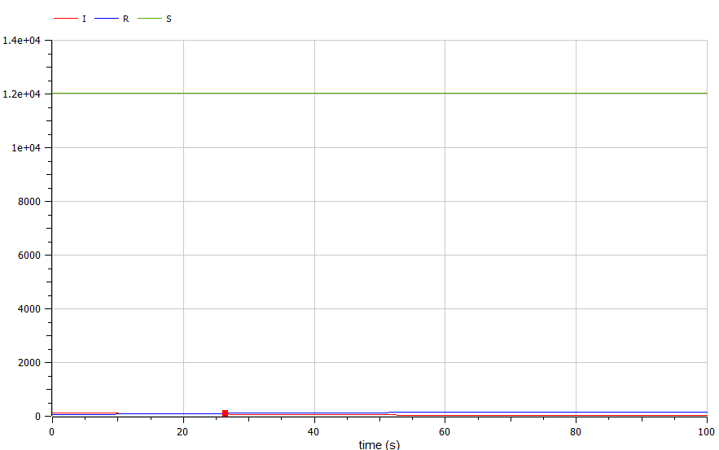
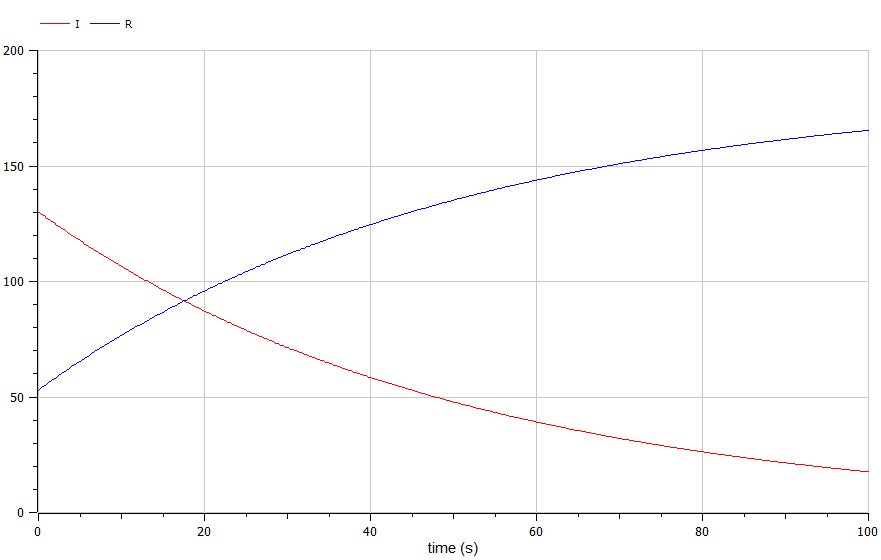
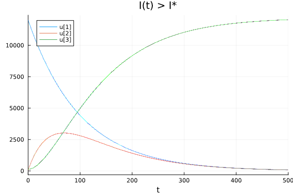
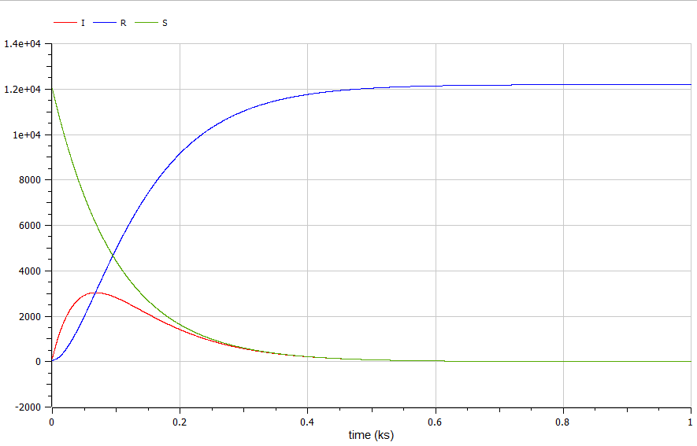

---
## Front matter
lang: ru-RU
title: Лабораторная работа № 6
subtitle: Задача об эпидемии
author:
  - Артамонов Т. Е.
institute:
  - Российский университет дружбы народов, Москва, Россия
date: 8 августа 2024

## i18n babel
babel-lang: russian
babel-otherlangs: english

## Formatting pdf
toc: false
toc-title: Содержание
slide_level: 2
aspectratio: 169
section-titles: true
theme: metropolis
header-includes:
 - \metroset{progressbar=frametitle,sectionpage=progressbar,numbering=fraction}
 - '\makeatletter'
 - '\beamer@ignorenonframefalse'
 - '\makeatother'
---

# Информация

## Докладчик

:::::::::::::: {.columns align=center}
::: {.column width="70%"}

  * Артамонов Тимофей Евгеньевич
  * студент группы НКНбд-01-21
  * Российский университет дружбы народов
  * <https://github.com/teartamonov>

:::
::: {.column width="30%"}

:::
::::::::::::::

# Введение

## Цель работы

- Рассмотреть простейшую модель эпидемии.
- Построить графики изменения количества каждой группы для 2 случаев.

## Теоретическое введение 1

Рассмотрим простейшую модель эпидемии. Предположим, что некая популяция, состоящая из N особей, (считаем, что популяция изолирована)
подразделяется на три группы. Первая группа - это восприимчивые к болезни, но пока здоровые особи, обозначим их через S(t). Вторая группа – это число
инфицированных особей, которые также при этом являются распространителями инфекции, обозначим их I(t). А третья группа, обозначающаяся через R(t) – это
здоровые особи с иммунитетом к болезни.

## Теоретическое введение 2

До того, как число заболевших не превышает критического значения I*, считаем, что все больные изолированы и не заражают здоровых. 
Когда $I(t) > I*$, тогда инфицирование способны заражать восприимчивых к болезни особей.

Таким образом, скорость изменения числа S(t) меняется по следующему закону:

$$
\frac{dS}{dt} = 
\begin{cases}
-\alpha S \textrm{, если  }I(t) > I* \\
0 \textrm{, если  } I(t) <= I*
\end{cases}
$$

I(t) меняется по следующему закону:

$$
\frac{dI}{dt} = 
\begin{cases}
\alpha S - \beta I \textrm{, если  }I(t) > I* \\
-\beta I \textrm{, если  } I(t) <= I*
\end{cases}
$$

## Теоретическое введение 3

R(t) меняется по следующему закону:
$\frac{dR}{dt} = \beta I$

Постоянные пропорциональности, $\alpha$, $\beta$ - это коэффициенты заболеваемости и выздоровления соответственно.

Будем считать, что начало эпидемии происходит в момент времени t = 0.

## Постановка задачи

На одном острове вспыхнула эпидемия. Известно, что из всех проживающих на острове (N = 12 200) в момент начала эпидемии (t=0) число заболевших людей
(являющихся распространителями инфекции) I(0) = 130, А число здоровых людей с иммунитетом к болезни R(0) = 53. Таким образом, число людей восприимчивых к
болезни, но пока здоровых, в начальный момент времени S(0) = N - I(0) - R(0).

## Задание 

Постройте графики изменения числа особей в каждой из трех групп. Рассмотрите, как будет протекать эпидемия в случае:
1) если I(0) > I*
2) если I(0) <= I*

# Выполнение работы

## Построили график изменения групп S, I, R когда I(0) <= I* на Julia. (рис. [-@fig:001])

{#fig:001 width=70%}

## Построили график на OpenModelica, графики одинаковые (рис. [-@fig:002])

{#fig:002 width=70%}

## Можно построить отдельно I и R, чтобы лучше понять, что происходит. (рис. [-@fig:003])

{#fig:003 width=70%}

## Построили график изменения групп S, I, R когда I(0) > I* на Julia. (рис. [-@fig:004])
Видно, что постепенно все люди заболевают, впоследствие приобретая иммунитет.

{#fig:004 width=70%}

## Построили такой же график в OpenModelica (рис. [-@fig:005])

{#fig:005 width=70%}

# Выводы

- Построили графики изменения численности групп S, I, R для 2 случаев
- Сравнили результаты на Julia и OpenModelica.
