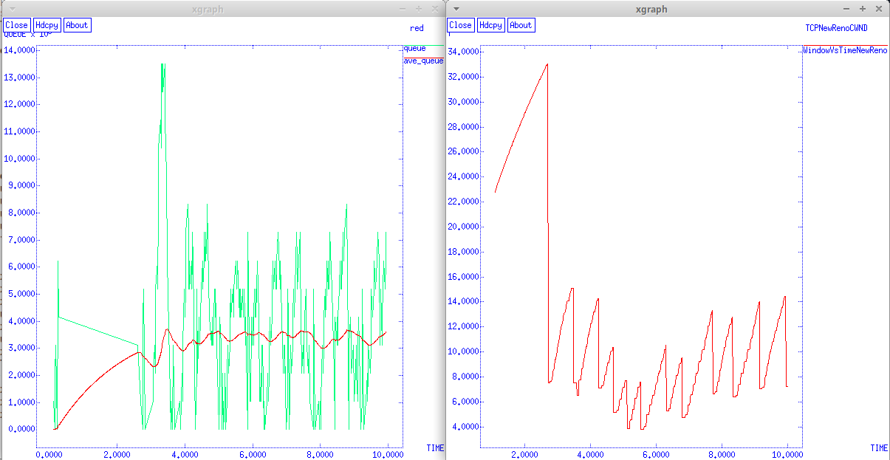

---
## Front matter
lang: ru-RU
title: Лабораторная работа № 2
subtitle: Исследование протокола TCP и алгоритма управления очередью RED
author:
  - Артамонов Т. Е.
institute:
  - Российский университет дружбы народов, Москва, Россия
date: 8 августа 2024

## i18n babel
babel-lang: russian
babel-otherlangs: english

## Formatting pdf
toc: false
toc-title: Содержание
slide_level: 2
aspectratio: 169
section-titles: true
theme: metropolis
header-includes:
 - \metroset{progressbar=frametitle,sectionpage=progressbar,numbering=fraction}
 - '\makeatletter'
 - '\beamer@ignorenonframefalse'
 - '\makeatother'
---

# Информация

## Докладчик

:::::::::::::: {.columns align=center}
::: {.column width="70%"}

  * Артамонов Тимофей Евгеньевич
  * студент группы НКНбд-01-21
  * Российский университет дружбы народов
  * <https://github.com/teartamonov>

:::
::: {.column width="30%"}

:::
::::::::::::::

# Введение

## Цели работы

- Приобретение навыков моделирования сетей передачи данных с помощью средства имитационного моделирования NS-2
- Анализ полученных результатов моделирования

## Теоретическое введение

Протокол управления передачей (Transmission Control Protocol, TCP) имеет средства управления потоком и коррекции ошибок, ориентирован на установление соединения. 
Управление потоком в протоколе TCP осуществляется при помощи скользящего окна переменного размера.

## Описание моделируемой сети:
– сеть состоит из 6 узлов
– между всеми узлами установлено дуплексное соединение с различными пропускной способностью и задержкой 10 мс
– узел r1 использует очередь с дисциплиной RED для накопления пакетов, максимальный размер которой составляет 25
– TCP-источники на узлах s1 и s2 подключаются к TCP-приёмнику на узле s3
– генераторы трафика FTP прикреплены к TCP-агентам

## Постановка задачи 

Требуется разработать сценарий, реализующий модель из задания, построить в Xgraph график изменения TCP-окна, график изменения длины очереди и средней длины очереди.

# Выполнение работы

## Переписали код из примера (рис. [-@fig:001])

{#fig:001 width=70%}

## Переписали код из примера (рис. [-@fig:002])

{#fig:003 width=70%}

## Получили 2 графика в xgraph. (рис. [-@fig:003])

{#fig:003 width=70%}

## Изменили Reno на NewReno, также изменили цвет фона, кривых, подписи осей и легенду. (рис. [-@fig:004])

{#fig:004 width=70%}

## Изменили NewReno на Vegas, также изменили цвет фона, кривых, подписи осей и легенду. (рис. [-@fig:005])

{#fig:005 width=70%}

## Выводы

- Исследовали протокол TCP
- Исследовали алгоритм управления очередью RED
- Исследовали инструмент xgraph
