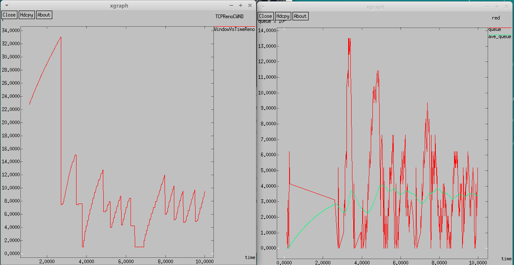

---
## Front matter
title: "Отчёт по лабораторной работе №2"
subtitle: "Исследование протокола TCP и алгоритма управления очередью RED"
author: "Артамонов Тимофей Евгеньевич"

## Generic otions
lang: ru-RU
toc-title: "Содержание"

## Bibliography
bibliography: bib/cite.bib
csl: pandoc/csl/gost-r-7-0-5-2008-numeric.csl

## Pdf output format
toc: true # Table of contents
toc-depth: 2
lof: true # List of figures
lot: true # List of tables
fontsize: 12pt
linestretch: 1.5
papersize: a4
documentclass: scrreprt
## I18n polyglossia
polyglossia-lang:
  name: russian
  options:
	- spelling=modern
	- babelshorthands=true
polyglossia-otherlangs:
  name: english
## I18n babel
babel-lang: russian
babel-otherlangs: english
## Fonts
mainfont: PT Serif
romanfont: PT Serif
sansfont: PT Sans
monofont: PT Mono
mainfontoptions: Ligatures=TeX
romanfontoptions: Ligatures=TeX
sansfontoptions: Ligatures=TeX,Scale=MatchLowercase
monofontoptions: Scale=MatchLowercase,Scale=0.9
## Biblatex
biblatex: true
biblio-style: "gost-numeric"
biblatexoptions:
  - parentracker=true
  - backend=biber
  - hyperref=auto
  - language=auto
  - autolang=other*
  - citestyle=gost-numeric
## Pandoc-crossref LaTeX customization
figureTitle: "Рис."
tableTitle: "Таблица"
listingTitle: "Листинг"
lofTitle: "Список иллюстраций"
lotTitle: "Список таблиц"
lolTitle: "Листинги"
## Misc options
indent: true
header-includes:
  - \usepackage{indentfirst}
  - \usepackage{float} # keep figures where there are in the text
  - \floatplacement{figure}{H} # keep figures where there are in the text
---

# Цель работы

- Исследовать протокол TCP
- Исследовать алгоритм управления очередью RED
- Исследовать инструмент xgraph
- Сравнить Reno, NewReno и Vegas
  
# Теоретическое введение

Протокол управления передачей (Transmission Control Protocol, TCP) имеет средства управления потоком и коррекции ошибок, ориентирован на установление соединения. 
Управление потоком в протоколе TCP осуществляется при помощи скользящего окна переменного размера.

# Описание моделируемой сети:
– сеть состоит из 6 узлов
– между всеми узлами установлено дуплексное соединение с различными пропускной способностью и задержкой 10 мс
– узел r1 использует очередь с дисциплиной RED для накопления пакетов, максимальный размер которой составляет 25
– TCP-источники на узлах s1 и s2 подключаются к TCP-приёмнику на узле s3
– генераторы трафика FTP прикреплены к TCP-агентам

# Постановка задачи 

Требуется разработать сценарий, реализующий модель из задания, построить в Xgraph график изменения TCP-окна, график изменения длины очереди и средней длины очереди.

# Выполнение лабораторной работы

Переписали код из примера (рис. [-@fig:001])

{#fig:001 width=70%}

Переписали код из примера (рис. [-@fig:002])

{#fig:003 width=70%}

Получили 2 графика в xgraph. (рис. [-@fig:003])

{#fig:003 width=70%}

Изменили Reno на NewReno, также изменили цвет фона, кривых, подписи осей и легенду. (рис. [-@fig:004])

{#fig:004 width=70%}

Изменили NewReno на Vegas, также изменили цвет фона, кривых, подписи осей и легенду. (рис. [-@fig:005])

{#fig:005 width=70%}

# Сравнение моделей протокола TCP

- NewReno и Reno почти идентичны
- График Vegas более стабильный

# Выводы

- Исследовали протокол TCP
- Исследовали алгоритм управления очередью RED
- Исследовали инструмент xgraph
- Сравнили Reno, NewReno и Vegas
