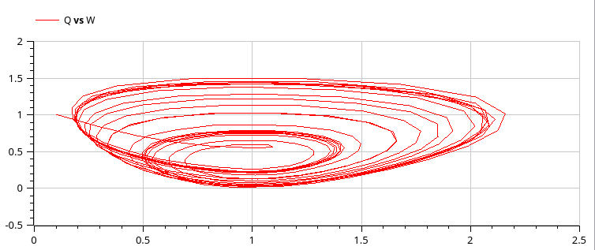

---
## Front matter
lang: ru-RU
title: Лабораторная работа № 11
subtitle: Модель системы массового обслуживания M|M|1
author:
  - Артамонов Т. Е.
institute:
  - Российский университет дружбы народов, Москва, Россия
date: 25 мая 2024

## i18n babel
babel-lang: russian
babel-otherlangs: english

## Formatting pdf
toc: false
toc-title: Содержание
slide_level: 2
aspectratio: 169
section-titles: true
theme: metropolis
header-includes:
 - \metroset{progressbar=frametitle,sectionpage=progressbar,numbering=fraction}
 - '\makeatletter'
 - '\beamer@ignorenonframefalse'
 - '\makeatother'
---

# Информация

## Докладчик

:::::::::::::: {.columns align=center}
::: {.column width="70%"}

  * Артамонов Тимофей Евгеньевич
  * студент группы НКНбд-01-21
  * Российский университет дружбы народов
  * <https://github.com/teartamonov>

:::
::: {.column width="30%"}

:::
::::::::::::::

# Введение

## Цель работы

- Реализовать модель в cpntools

## Теоретическое введение

В систему поступает поток заявок двух типов, распределённый по пуассоновскому закону. Заявки поступают в очередь сервера на обработку. 
Дисциплина очереди - FIFO. Если сервер находится в режиме ожидания (нет заявок на сервере), то заявка поступает на обработку сервером.

# Выполнение лабораторной работы

## Построили модель на трёх страницах. (рис. [-@fig:001])

{#fig:001 width=70%}

## Построили модель на трёх страницах. (рис. [-@fig:002])

{#fig:002 width=70%}

## Построили модель на трёх страницах. (рис. [-@fig:003])

{#fig:003 width=70%}

## Запустили модель. (рис. [-@fig:004])

{#fig:004 width=70%}

## Построили график изменения задержки очереди. (рис. [-@fig:005])

{#fig:005 width=70%}

## Построили график с периодами времени, когда задержка превышала лимит. (рис. [-@fig:006])

{#fig:006 width=70%}

## Выводы

- Реализовали модель в cpntools
