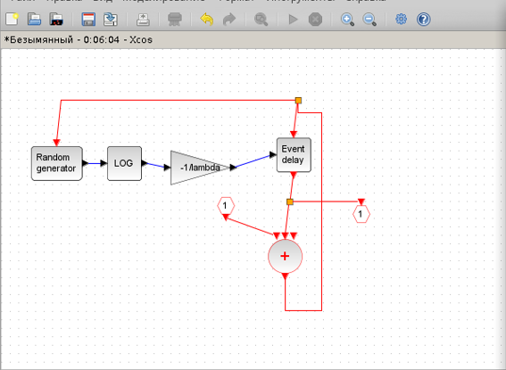

---
## Front matter
lang: ru-RU
title: Лабораторная работа № 16
subtitle: Задачи оптимизации. Модель двух стратегий обслуживания
author:
  - Артамонов Т. Е.
institute:
  - Российский университет дружбы народов, Москва, Россия
date: 08 июня 2024

## i18n babel
babel-lang: russian
babel-otherlangs: english

## Formatting pdf
toc: false
toc-title: Содержание
slide_level: 2
aspectratio: 169
section-titles: true
theme: metropolis
header-includes:
 - \metroset{progressbar=frametitle,sectionpage=progressbar,numbering=fraction}
 - '\makeatletter'
 - '\beamer@ignorenonframefalse'
 - '\makeatother'
---

# Информация

## Докладчик

:::::::::::::: {.columns align=center}
::: {.column width="70%"}

  * Артамонов Тимофей Евгеньевич
  * студент группы НКНбд-01-21
  * Российский университет дружбы народов
  * <https://github.com/teartamonov>

:::
::: {.column width="30%"}

:::
::::::::::::::

# Введение

## Цель работы

- Построить модели двух стратегий обслуживания
- Построить отчеты по этим моделям
- Проанализировать отчеты и найти лучшую стратегию
- Найти оптмильное количество пунктов для каждой стратегии

## Постановка задачи

На пограничном контрольно-пропускном пункте транспорта имеются 2 пункта пропуска. Интервалы времени между поступлением автомобилей имеют экспоненциальное распределение со средним значением m. 
Время прохождения автомобилями пограничного контроля имеет равномерное распределение на интервале [a, b].
Предлагается две стратегии обслуживания прибывающих автомобилей:
1. Автомобили образуют две очереди и обслуживаются соответствующими пунктами пропуска
2. Автомобили образуют одну общую очередь и обслуживаются освободившимся пунктом пропуска.
Исходные данные: m = 1.75 мин, a = 1 мин, b = 7 мин.

# Выполнение лабораторной работы

## Построим модель для первой стратегии (рис. [-@fig:001] )

{#fig:001 width=70%}

## Сформируем отчет по модели (рис. [-@fig:002] )

{#fig:002 width=70%}

## Построим модель для второй стратегии. (рис. [-@fig:003] )

{#fig:003 width=70%}

## Сформируем отчёт. (рис. [-@fig:004] )

{#fig:004 width=70%}

## Заполним таблицу для сравнения стратегий. (рис. [-@fig:005] )

{#fig:005 width=70%}

## Подберем оптимальное число пунктов для второй стратегии  (рис. [-@fig:006] )

{#fig:006 width=70%}

## Подберем оптимальное число пунктов для первой стратегии  (рис. [-@fig:007] )

{#fig:007 width=70%}

## Сформируем отчёт  (рис. [-@fig:008] )

{#fig:008 width=70%}

## Подберем оптимальное число пунктов для первой стратегии  (рис. [-@fig:009] )

{#fig:009 width=70%}

## Сформируем отчёт  (рис. [-@fig:010] )

{#fig:010 width=70%}

## Выводы

- Построили модели двух стратегий обслуживания
- Построили отчеты по этим моделям
- Проанализировали отчеты и найти лучшую стратегию
- Нашли оптмильное количество пунктов для каждой стратегии
