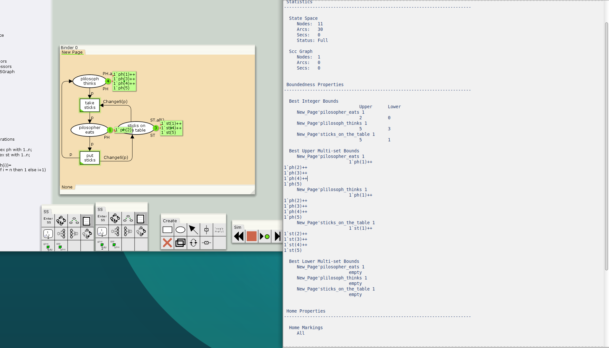
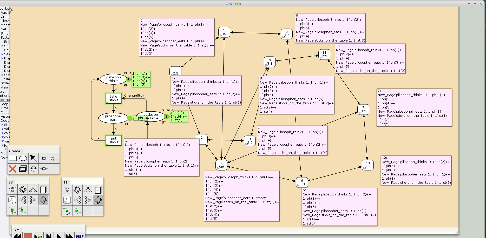

---
## Front matter
lang: ru-RU
title: Лабораторная работа № 15
subtitle: Модели обслуживания с приоритетами
author:
  - Артамонов Т. Е.
institute:
  - Российский университет дружбы народов, Москва, Россия
date: 08 июня 2024

## i18n babel
babel-lang: russian
babel-otherlangs: english

## Formatting pdf
toc: false
toc-title: Содержание
slide_level: 2
aspectratio: 169
section-titles: true
theme: metropolis
header-includes:
 - \metroset{progressbar=frametitle,sectionpage=progressbar,numbering=fraction}
 - '\makeatletter'
 - '\beamer@ignorenonframefalse'
 - '\makeatother'
---

# Информация

## Докладчик

:::::::::::::: {.columns align=center}
::: {.column width="70%"}

  * Артамонов Тимофей Евгеньевич
  * студент группы НКНбд-01-21
  * Российский университет дружбы народов
  * <https://github.com/teartamonov>

:::
::: {.column width="30%"}

:::
::::::::::::::

# Введение

## Цель работы

- Построить различные модели обработки заказов
- Проанализировать отчеты по этим моделям
- Построить гистрограмму модели

## Постановка задачи 1

На фабрике на складе работает один кладовщик, который выдает запасные части механикам, обслуживающим станки. Время, необходимое для удовлетворения запроса, зависит от типа запасной части. Запросы бывают двух категорий. 
Для первой категории интервалы времени прихода механиков 420 +- 360 сек., время обслуживания - 300 +- 90 сек. Для второй категории интервалы времени прихода механиков 360 +- 240 сек., время обслуживания - 100 +- 30 сек.
Порядок обслуживания механиков кладовщиком такой: запросы первой категории обслуживаются только в том случае, когда в очереди нет ни одного запроса второй категории. Необходимо создать модель работы кладовой, моделирование выполнять в течение восьмичасового рабочего дня.

## Постановка задачи 2

Морские суда двух типов прибывают в порт, где происходит их разгрузка. В порту есть два буксира, обеспечивающих ввод и вывод кораблей из порта. К первому типу судов относятся корабли малого тоннажа, которые требуют использования одного буксира. 
Корабли второго типа имеют большие размеры, и для их ввода и вывода из порта требуется два буксира. Из-за различия размеров двух типов кораблей необходимы и причалы различного размера. Кроме того, корабли имеют различное время погрузки/разгрузки. 
Требуется построить модель системы, в которой можно оценить время ожидания кораблями каждого типа входа в порт. Время ожидания входа в порт включает время ожидания освобождения причала и буксира. 
Корабль, ожидающий освобождения причала, не обслуживается буксиром до тех пор, пока не будет предоставлен нужный причал. Корабль второго типа не займёт буксир до тех пор, пока ему не будут доступны оба буксира.

# Выполнение лабораторной работы

## Построим первую модель (рис. [-@fig:001] )

{#fig:001 width=50%}

## Сформируем отчет по модели (рис. [-@fig:002] )

{#fig:002 width=70%}

## Построим вторую модель. (рис. [-@fig:003] )

{#fig:003 width=70%}

## Сформируем отчёт. (рис. [-@fig:004] )

{#fig:004 width=70%}

## Построим гистограмму распределения заявок в очереди. (рис. [-@fig:005] )

{#fig:005 width=70%}

## Выводы

- Построили различные модели обработки заказов
- Проанализировали отчеты по этим моделям
- Научились строить гистрограмму модели
