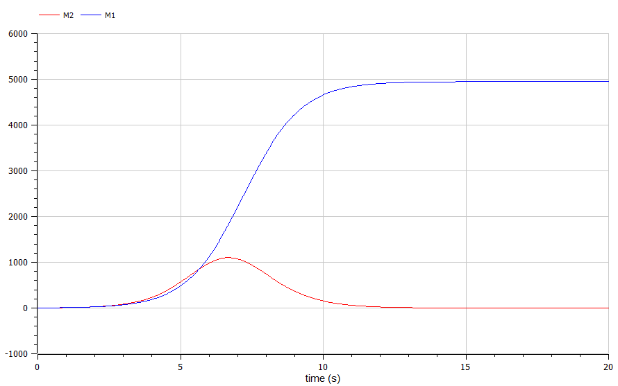

---
## Front matter
title: "Отчёт по лабораторной работе №8"
subtitle: "Модель конкуренции двух фирм"
author: "Артамонов Тимофей Евгеньевич"

## Generic otions
lang: ru-RU
toc-title: "Содержание"

## Bibliography
bibliography: bib/cite.bib
csl: pandoc/csl/gost-r-7-0-5-2008-numeric.csl

## Pdf output format
toc: true # Table of contents
toc-depth: 2
lof: true # List of figures
lot: true # List of tables
fontsize: 12pt
linestretch: 1.5
papersize: a4
documentclass: scrreprt
## I18n polyglossia
polyglossia-lang:
  name: russian
  options:
	- spelling=modern
	- babelshorthands=true
polyglossia-otherlangs:
  name: english
## I18n babel
babel-lang: russian
babel-otherlangs: english
## Fonts
mainfont: PT Serif
romanfont: PT Serif
sansfont: PT Sans
monofont: PT Mono
mainfontoptions: Ligatures=TeX
romanfontoptions: Ligatures=TeX
sansfontoptions: Ligatures=TeX,Scale=MatchLowercase
monofontoptions: Scale=MatchLowercase,Scale=0.9
## Biblatex
biblatex: true
biblio-style: "gost-numeric"
biblatexoptions:
  - parentracker=true
  - backend=biber
  - hyperref=auto
  - language=auto
  - autolang=other*
  - citestyle=gost-numeric
## Pandoc-crossref LaTeX customization
figureTitle: "Рис."
tableTitle: "Таблица"
listingTitle: "Листинг"
lofTitle: "Список иллюстраций"
lotTitle: "Список таблиц"
lolTitle: "Листинги"
## Misc options
indent: true
header-includes:
  - \usepackage{indentfirst}
  - \usepackage{float} # keep figures where there are in the text
  - \floatplacement{figure}{H} # keep figures where there are in the text
---

# Цель работы

- Рассмотреть модель конкуренции 2 фирм.
- Построить графики изменения оборотных средств двух фирм для 2 случаев:
  - только c экономическим фактором влияния
  - с добавлением социально-психологических факторов
- Сравнить результаты на 2 языках программирования
  
# Теоретическое введение

Конкуренция - это борьба между экономическими субъектами за максимально эффективное использование факторов производства, при единых правилах для всех её участников.  [@wiki:bash]

**Конкуренция двух фирм**
**Случай 1**

Рассмотрим две фирмы, производящие взаимозаменяемые товары
одинакового качества и находящиеся в одной рыночной нише. Последнее означает,
что у потребителей в этой нише нет априорных предпочтений, и они приобретут
тот или иной товар, не обращая внимания на знак фирмы.
В этом случае, на рынке устанавливается единая цена, которая определяется
балансом суммарного предложения и спроса. Иными словами, в рамках нашей
модели конкурентная борьба ведётся только рыночными методами. То есть,
конкуренты могут влиять на противника путем изменения параметров своего
производства: себестоимость, время цикла, но не могут прямо вмешиваться в
ситуацию на рынке («назначать» цену или влиять на потребителей каким-
либо иным способом.)
Учтем, что товарный баланс устанавливается быстро, то есть,
произведенный каждой фирмой товар не накапливается, а реализуется по цене p.
Тогда

$$
\frac{dM1}{dt} = M_1 - \frac{b}{c_1} M_1 M_2 - \frac{a_1}{c_1} M_1^2 \\
\frac{dM2}{dt} = \frac{c_2}{c_1} M_2 - \frac{b}{c_1} M_1 M_2 - \frac{a_2}{c_1} M_2^2
$$

где


$a_1 = \frac{p_cr}{\tau_1 p_1^2 N q}$, $a_2 = \frac{p_cr}{\tau_2 p_2^2 N q}$, $b = a_1 = \frac{p_cr}{\tau_1 p_1^2 \tau_2 p_2^2 N q}$, $c1 = \frac{p_cr - p_1}{\tau_1 p_1}$, $c2 = \frac{p_cr - p_2}{\tau_2 p_2}$

$q$ - максимальная потребность одного человека в продукте в единицу времени.
$p_cr$ - критическая стоимость продукта.
$N$ - число потребителей производимого продукта.
$M_1, M_2$ - оборотные средства предприятия.
$\tau_1, \tau_2$ - длительность производственного цикла.
$p_1, p_2$ - себестоимость продукта, то есть переменные издержки на производство единицы продукции.


Будем считать, что начало рекламной кампании происходит в момент времени t = 0.

# Постановка задачи

Даны 3 уравнения распространения рекламы:

1. $$\frac{dn}{dt} = (0.74 + 0.000074 n(t)) (N - n(t))$$
2. $$\frac{dn}{dt} = (0.000074 + 0.74 n(t)) (N - n(t))$$
3. $$\frac{dn}{dt} = (0.74 \sin(t) + 0.74 \cos(t) n) (N - n(t))$$

# Задание 

Постройте график распространения рекламы, описанные данными уравнениями. При этом объем аудитории $N = 1060$, в начальный момент о товаре знает 7 человек.

# Выполнение лабораторной работы

Написали код на Julia:
```julia

using DifferentialEquations, Plots
#Уравнение 1
promotion1(n, p, t) = (0.74 + 0.000074*n)*(p - n)
#Уравнение 2
promotion2(n, p, t) = (0.000074 + 0.74*n)*(p - n)
#Уравнение 3
promotion3(n, p, t) = (0.74*sin(t) + 0.74*cos(t)*n)*(p - n)

# Параметры и условия
p = 1060 # N - количество потенциальных клиентов
x0 = 7 # n - количество людей, знающих о продукции
tspan1 = (0, 10) # Временной промежуток для первого уравнения
tspan2 = (0, 0.02) # Временной промежуток для второго и третьего уравнений

# Решение уравнений для 3 случаев

prob1 = ODEProblem(promotion1, x0, tspan1, p)
sol1 = solve(prob1, Tsit5(), dtmax = 0.05)

prob2 = ODEProblem(promotion2, x0, tspan2, p)
sol2 = solve(prob2, Tsit5(), dtmax = 0.05)

prob3 = ODEProblem(promotion3, x0, tspan2, p)
sol3 = solve(prob3, Tsit5(), dtmax = 0.05)

# Графики решений
#plot(sol1, title = "Случай a1(t) >> a2(t)")
#plot(sol2, title = "Случай a1(t) << a2(t)")
plot(sol3, title = "Случай c непостоянными a1 и a2")
```

Записали 3 случая на языке OpenModelica 
Случай 1
```
model lab7

parameter Real a = 0.74;
parameter Real b = 0.000074;
parameter Real c = 1060;

Real A(start = 7);


equation
  der(A) = (a + b*A)*(c - A);
  
  
end lab7;

```
Случай 2
```
model lab7

parameter Real a = 0.74;
parameter Real b = 0.000074;
parameter Real c = 1060;

Real B(start = 7);


equation
  der(B) = (b + a*B)*(c - B);
  
  
end lab7;
```
Случай 3
```
model lab7

parameter Real a = 0.74;
parameter Real b = 0.000074;
parameter Real c = 1060;
Real p;
Real q;

Real C(start = 7);


equation
  der(C) = (a*p + a*q*C)*(c - C);
  p = sin(time);
  q = cos(time);
  
end lab7;
```


и получили следующие результаты.

Построили график распространения рекламы, когда $\alpha_1(t) >> \alpha_2(t)$ на Julia. (рис. [-@fig:001])

{#fig:001 width=70%}

Построили график на OpenModelica, графики одинаковые (рис. [-@fig:002])

{#fig:002 width=70%}

Построили график распространения рекламы, когда $\alpha_1(t) << \alpha_2(t)$ на Julia. (рис. [-@fig:003])

{#fig:003 width=70%}

Построили такой же график в OpenModelica. Графики совпадают. (рис. [-@fig:004])

{#fig:004 width=70%}

Построили график распространения рекламы, когда $\alpha_1(t)$ и  $\alpha_2(t)$ имеют синусоидальную и косинусоидальную зависимости от времени на Julia. (рис. [-@fig:005])

{#fig:005 width=70%}

Построили такой же график в OpenModelica. Графики совпадают. (рис. [-@fig:006])

{#fig:006 width=70%}

# Выводы

- Построили графики распространения рекламы для 3 случаев
- Сравнили результаты на Julia и OpenModelica.

# Список литературы{.unnumbered}

::: {#refs}
:::
