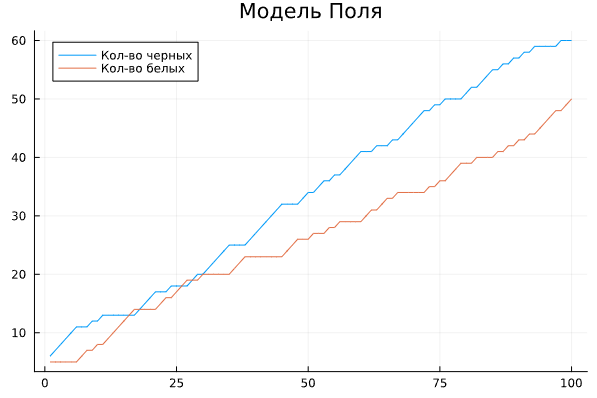
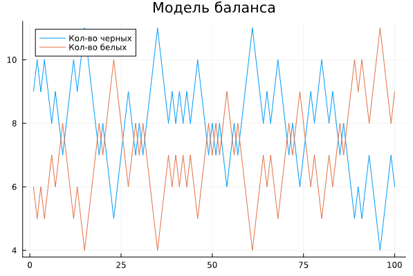

---
## Front matter
title: "Доклад"
subtitle: "Модели с урнами"
author: "Артамонов Тимофей Евгеньевич"

## Generic otions
lang: ru-RU
toc-title: "Содержание"

## Bibliography
bibliography: bib/cite.bib
csl: pandoc/csl/gost-r-7-0-5-2008-numeric.csl

## Pdf output format
toc: true # Table of contents
toc-depth: 2
lof: true # List of figures
lot: true # List of tables
fontsize: 12pt
linestretch: 1.5
papersize: a4
documentclass: scrreprt
## I18n polyglossia
polyglossia-lang:
  name: russian
  options:
	- spelling=modern
	- babelshorthands=true
polyglossia-otherlangs:
  name: english
## I18n babel
babel-lang: russian
babel-otherlangs: english
## Fonts
mainfont: PT Serif
romanfont: PT Serif
sansfont: PT Sans
monofont: PT Mono
mainfontoptions: Ligatures=TeX
romanfontoptions: Ligatures=TeX
sansfontoptions: Ligatures=TeX,Scale=MatchLowercase
monofontoptions: Scale=MatchLowercase,Scale=0.9
## Biblatex
biblatex: true
biblio-style: "gost-numeric"
biblatexoptions:
  - parentracker=true
  - backend=biber
  - hyperref=auto
  - language=auto
  - autolang=other*
  - citestyle=gost-numeric
## Pandoc-crossref LaTeX customization
figureTitle: "Рис."
tableTitle: "Таблица"
listingTitle: "Листинг"
lofTitle: "Список иллюстраций"
lotTitle: "Список таблиц"
lolTitle: "Листинги"
## Misc options
indent: true
header-includes:
  - \usepackage{indentfirst}
  - \usepackage{float} # keep figures where there are in the text
  - \floatplacement{figure}{H} # keep figures where there are in the text
---

# Цель работы

Исследовать модели с урнами и рассмотреть области их применения.

# Задачи

- Рассмотреть базовую модель с урнами
- Исследовать разновидности моделей с урнами
- Рассмотреть область их применения

# Определение

В теории вероятности и статистике задача об урне — это идеализированный мысленный эксперимент, 
в котором некоторые объекты, представляющие реальный интерес, представлены в виде цветных шариков 
в урне. Кто-то делает вид, что вынимает из урны один или несколько шаров; 
цель — определить вероятность того, что вынутые шары или же шар того или иного цвета.

Модель урны — это либо набор вероятностей, описывающих события в задаче с урной, 
либо распределение вероятностей или семейство таких распределений случайных величин, 
связанных с задачами с урной. 

# Разновидности

## Базовая модель (Модель без возвращения)

В этой базовой модели урны в теории вероятностей урна содержит n белых и m черных шаров, 
хорошо перемешанных друг с другом. Из урны случайным образом вынимают один шар и наблюдают за его цветом. Процесс выбора повторяется.
Вероятность успеха меняется после каждого процесса выбора, поскольку каждый раз общее количество шаров в урне уменьшается.
Такую модель называют извлечением без замены. Такая модель будет зависеть от истории.

Для модели без возвращения вероятность вытянуть $k$ шаров, из урны с $m$ черными и $n$ белыми шарами, из которых $l$ черных шаров можно выразить следующей формулой:
$$
P(k) = \frac{\binom{m}{l} \binom{n}{k-l}}{\binom{m+n}{k}}​
$$
Где:
$P(k)$ - вероятность вытянуть kk черных шаров

$\binom{n}{k} = \frac{k!}{n!(n-k)!}$ - количество способов выбрать k элементов из n элементов (сочетание)
$m$ - количество черных шаров в урне
$n$ - количество белых шаров в урне
$k$ - количество шаров, которое вытаскивают
$l$ - количество черных шаров, которое необходимо вытащить

## Модель Бернулли
Модель Бернулли описывает случайный эксперимент с двумя возможными исходами: 
успехом и неудачей. Обозначим вероятность успеха как $p$ и вероятность неудачи как $q$. При этом должно выполняться условие $p+q=1$.
Успех и неудача в случае с урнами это вынутый шар черного или белог цвета.
В данной модели, после того, как шар достают, его возвращают обратно в урну, т.к. эксперимент Бернулли - независимый эксперимент. 
Таким образом независимо от количества испытаний, эксперимент не меняется, т.е. вероятность не зависит от истории.

Формула для расчёта вероятности того, что из урны с $m$ черными шарами и $n$ белыми шарами будет вытянуто $l$ черных шаров для данной модели выглядит следующим образом:
$$
P(k) = \binom{k}{l} * p^l * (1 - p)^{k-l}
$$
Где:
$P(k)$ - вероятность того, что будет вытянуто kk черных шаров
$p$ - вероятность вытащить черный шар
$k$ - количество шаров, которые вытаcкивают
$l$ - количество черных шаров, которые нужно вытащить

## Модель Поля
В статистике модель урны Поля, названная в честь Джорджа Поля, представляет собой модель, в которой 
после того, как шар достается, он возвращается в урну, и ещё добавляется шар такого же цвета. Этот процесс повторяется.
Можно заметить, что если, например, белых шаров больше чем чёрных, то с большей вероятностью будет добавлен белый шар. 
То есть эта урна зависит от истории и сходится. 

Эта модель выборке без замены: каждый раз, когда наблюдается определенное значение, вероятность его повторного 
наблюдения снижается, тогда как в модели урны Пойа наблюдаемое значение с большей вероятностью будет наблюдаться снова. 
В модели урны Пойя последовательные акты измерения с течением времени оказывают все меньше и меньше влияния на будущие измерения, 
тогда как при отборе проб без замены верно обратное: после определенного количества измерений определенного значения это значение 
больше никогда не появится. [@wiki:bash]

Даже если мы смоделируем ситуацию, где в урне находится одинаковое количество шаров черного и белого цвета, в итоге, 
в результате эффекта снежного кома, количество шаров одного цвета будет сильно больше шаров другого цвета.
Допустим, вы начинаете с равным количеством шаров (5 белых, 5 черных). Если после первого испытания будет выбран белый шар, 
в урне окажется 6 белых и 5 черных шаров. Это автоматически создает неравенство, при котором в следующем испытании с большей вероятностью 
будет выбран белый шар, нежели черный. Шансы теперь составляют 6/11, что будет выбран белый шар, и 5/11, что вы выберете черный. 
Этот фактор и может стать снежным комом. [@polya:bash]

График изменения количества шаров в урне Поля при m = 5, n = 5.  (рис. [-@fig:001])

{ #fig:001 width=70% }

## Модель баланса
Модель баланса или же модель плохой выборной компании - модель которую изучал Фридман, и ее можно рассматривать как
моделирование пропагандистской кампании, в которой кандидаты настолько плохи, что люди, которые их слушают,
решают голосовать за противоположного кандидата. Данная урна, в отличие от урны Поля, стремится сохранить баланс черных и белых шаров. [@book:one]

В данной модели после выемки шара в урну кладётся шар противоположного цвета. Модель сходится к равновесию.
В этой модели для урны с $m$ черных и $n$ белых шаров, вероятность того, что из $k$ вынутых шаров $l$ из них будут черными будет зависеть от порядка вынимания шаров, поэтому предположим, что после вынимания черного шара, следующим вынутым буддет белый шар.

График изменения количества шаров в урне Фридмана при m = 10, n = 5. Среднее значение 7.5, поэтому количество черных и белых шаров колеблется возле этого значения. (рис. [-@fig:002])

{ #fig:002 width=70% }

# Области применения

## Теория вероятности
Модели с урнами - это мощный инструмент в теории вероятностей, используемый для моделирования случайных событий.
Каждая из упомянутых моделей используется в теории вероятностей для анализа случайных процессов и событий а так же вероятностных распределений
из многих областей нашей жизни и помогает решать реальные задачи.

## Генетика
В генетике модели с урнами могут быть использованы для описания процессов мутации и передачи генов. 
Например, урна с генами различных аллелей может быть использована для моделирования генетического разнообразия в популяции.
Модель урны схожая с моделью Поля используется для моделирования генетического дрейфа в теоретической популяционной генетике. [@wiki:polya]

## Экономика
В экономике модели с урнами могут быть применены для анализа случайных процессов в экономике, 
таких как изменения цен, вариации спроса и предложения, а также для моделирования рисков и случайных событий в финансовых рынках.

## Обучающие процессы
Эти модели являются продолжением процесса Поля. Один из вариантов, так называемая стохастическая модель обучения 
с двумя вариантами ответов, предложенная Одли и Джонкхиром (1956). Мы рассматриваем последовательность испытаний, 
в каждом из которых испытуемый должен отреагировать одним из двух возможных способов. 
Один ответ "вознаграждается" — положительная оценка — каждый раз, когда он совершается. 
Другой "наказаывается" — негативная оценка. Таким образом, (i + 1)-й ответ субъекта, скорее всего, будет зависеть от каждого из первых i ответов.
Используя эту модель, Одли и Джонкхир получили условное распределение вероятности успеха в (n + 1)-м испытании, учитывая результаты предыдущих n испытаний. 

## Биология
Capture-recapture дано целому классу методов, используемых для оценки размеров естественных популяций. 
Многие из них происходят из работ Шнабеля(1938) и Чапмана(1952), в которых обсуждается оценка численности рыбы f в озере. 
Предложенный метод состоял в разделении рыбы на меченую и немеченую.[@book:two]

# Выводы

В работе были исследованы разновидности моделей с урнами, а так же было рассмотренно их применение в различных областях. Таким образом, 
хотя модель с урнами - это и простой мысленный эксперимент, различные её виды внесли вклад в развитие многих областей нашей жизни и используются и по сей день.

# Список литературы{.unnumbered}

::: {#refs}
:::
