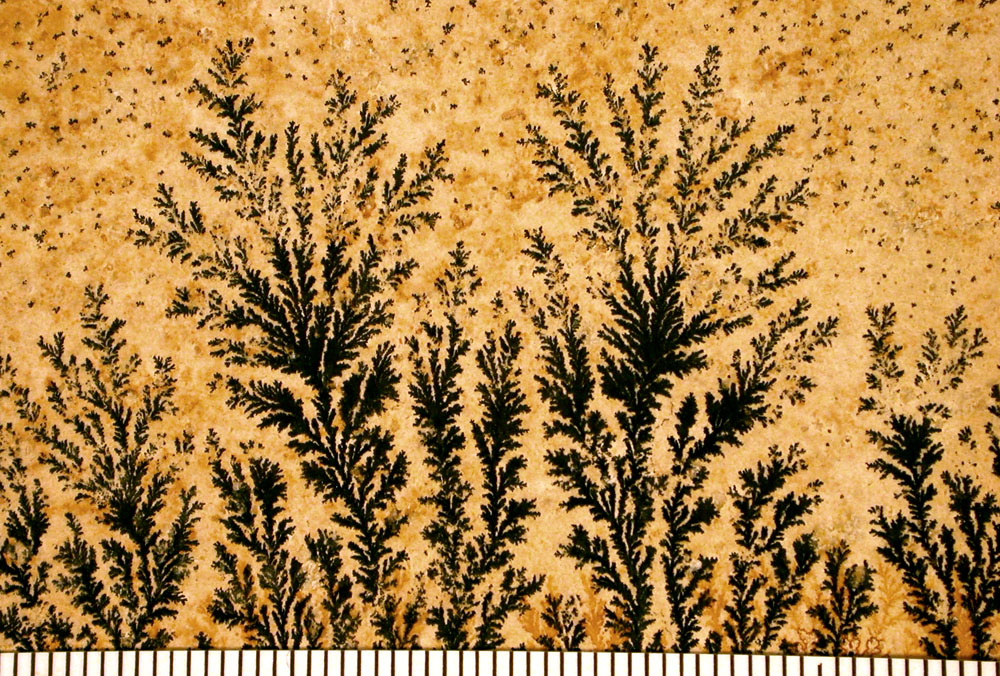

---
## Front matter
lang: ru-RU
title: "Групповой проект. Тема: Рост дендритов"
subtitle: "Этап 1"
author:
	- Артамонов Т. Е.,
	- Федорина Э. В.,
	- Морозов М. E.,
	- Коротун И. И.,
	- Маслова А. С.
institute: Российский Университет Дружбы Народов, Moscow, Russian Federation

date: 24 февраля 2024

## i18n babel
babel-lang: russian
babel-otherlangs: english

## Formatting pdf
toc: false
toc-title: Содержание
slide_level: 2
aspectratio: 169
section-titles: true
theme: metropolis
header-includes:
 - \metroset{progressbar=frametitle,sectionpage=progressbar,numbering=fraction}
 - '\makeatletter'
 - '\beamer@ignorenonframefalse'
 - '\makeatother'
---
# Информация

## Состав исследовательской команды

Студенты группы НКНбд-01-21

- Артамонов Тимофей Евгеньевич
- Федорина Эрнест Васильевич
- Морозов Михаил Евгеньвич
- Коротун Илья Игоревич
- Маслова Анастасия Сергеевна

# Вводная часть

## Определение

Дендриты — это древовидные кристаллические структуры, которые образуются в процессе кристаллизации из переохлажденного расплава. Они играют ключевую роль в определении микроструктуры и, следовательно, физических свойств материалов. Процесс роста дендритов зависит от множества факторов. Если исследовать механизм формирования дендритов, то можно научиться изменять свойства различных сплавов, а значит исследование полезно не только для теории, но и для практики.

{#fig:001 width=70%}

# Формирование и описание научной проблемы

## Проблема управления и предсказания морфологии дендритной кристаллизации в переохлажденных расплавах

В процессе формирования кристаллических структур из переохлажденных расплавов ключевым является понимание и управление механизмами роста дендритов, поскольку именно они определяют конечные физические свойства материалов. Дендритный рост, происходящий в результате кристаллизации, существенно влияет на микроструктуру и, как следствие, на механические, электрические и тепловые характеристики материалов. Таким образом, научная проблема заключается в разработке теоретических и численных моделей, способных точно предсказывать динамику роста дендритов и их влияние на микроструктуру сформированных материалов.

{#fig:002 width=70%}

## Актуальность

Решение этой проблемы откроет новые возможности для оптимизации процессов производства материалов с высокими эксплуатационными характеристиками и для создания новых материалов с уникальными свойствами.

## Задачи

- Написать программу, моделирующую теплопроводность. Задать начальную температуру равной нулю везде, кроме центральной точки и посмотреть, как меняется распределение температуры.
- Добавить затвердевание, исследовать влияние начального переохлаждения S и величины капиллярного радиуса λ на форму образующихся дендритов.
- Исследовать зависимость от времени числа частиц в агрегате и его среднеквадратичного радиуса в разных режимах.
- Определить фрактальную размерность полученных образцов
- Исследуйте, как влияет величина теплового шума δ на вид образующихся агрегатов.

# Важные формулы

- **Безразмерное переохлаждение:**
$$S = \frac{c_p (T_m - T_\infty)}{L}$$

- **Уравнение теплопроводности:**
$$\rho c_p \frac{\partial T}{\partial t} = \kappa \nabla^2 T$$

- **Условие Стефана для скорости \(V\):**
$$V = \frac{\kappa}{\rho L} (\nabla T|_s - \nabla T|_l)$$

- **Условие Гиббса-Томсона:**
$$T_b = T_m \left(1 - \frac{\gamma T_m}{\rho L^2 R}\right)$$

- **Кинетическая модификация температуры на границе:**
$$\Delta T_b = -T_m \beta V$$

# Выводы

Во время выполнения первого этапа группового проекта мы сделали теоретическое описание модели "Рост дендритов", аналитически исследовали её и поставили задачу нашей работы.

# Список литературы

1. Д. А. Медведев, А. Л. Куперштох, Э. Р. Прууэл, Н. П. Сатонкина, Д. И. Карпов. МОДЕЛИРОВАНИЕ ФИЗИЧЕСКИХ ПРОЦЕССОВ И ЯВЛЕНИЙ НА ПК учебное пособие. НГУ, 2010. 91-96с.
2. Дендрит(кристалл) [Электронный ресурс]. Wikimedia Foundation, Inc., 2024. URL: )

